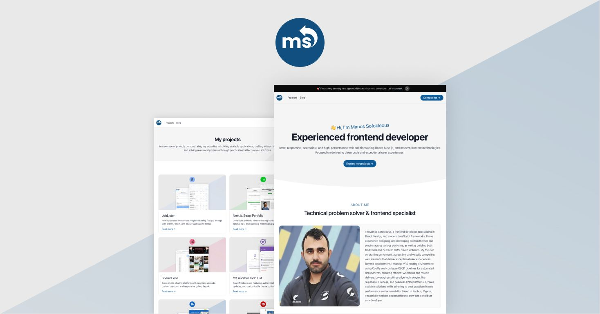

# Next.js, Strapi Portfolio Starter



## Table of contents
1. [Description](#description)
2. [Features](#features)
3. [Development setup guide](#development-setup-guide)
4. [Production setup guide](#production-setup-guide)
5. [Roadmap](#roadmap)
6. [Acknowledgements](#acknowledgements)
7. [Contributing](#contributing)
8. [License](#license)

## Description

This project is a modern portfolio website built as a monorepo containing **Next.js** and **Strapi CMS**. Designed for developers, freelancers, and agencies, it effectively showcases skills, projects, and achievements through a performant, SEO-optimized platform.

The website features statically generated pages for projects, blog posts, and a secure contact form with both client-side and server-side validation. Content is seamlessly managed in Strapi CMS, including SEO configurations (titles, meta descriptions), while JSON-LD schemas (BlogPosting, Organization, etc.) enhance search engine visibility. Optimizations include a dynamic XML sitemap, OpenGraph metadata, image optimizations, semantic HTML and many more.

Security measures like honeypot spam protection, API rate limiting, and email obfuscation safeguard sensitive data. Built with Tailwind CSS for rapid styling, this starter template balances flexibility with maintainability—ideal for portfolios, agencies, or developers prioritizing performance, accessibility, and modern best practices.

**[View demo](https://msof.me/)**

The demo website achieves outstanding PageSpeed scores:

| Device   | Performance | Accessibility | Best Practices | SEO |
|----------|-------------|---------------|----------------|-----|
| Mobile   | 98          | 100           | 100            | 100 |
| Desktop  | 100         | 100           | 100            | 100 |

*Captured at May 8, 2025, 3:18 PM GMT+3*

## Features

### Core functionality

✅ Dynamic content management:

- All content is managed via Strapi CMS, allowing easy updates without code changes.

✅ Demo content & quick setup:

- Demo included for instant exploration.

✅ Home page:

- Features a hero, about, skills, experience or services, featured projects, testimonials, latest posts, FAQ, and a prominent call-to-action.
- A dynamic zone allows users to tailor the homepage based on their needs:
  - Experience section: For developers showcasing their career journey.
  - Services section: For freelance developers or agencies highlighting their offerings.

✅ Projects:

- A dynamically updated projects page that lists all published projects and supports dynamic sorting. Each project has a dedicated page with detailed information, rich metadata for SEO, and syntax highlighting for code snippets.

✅ Blog:

- A dynamically updated blog page that lists all published posts in reverse chronological order. Each post has a dedicated page with detailed content, rich metadata for SEO, and syntax highlighting for code snippets.

✅ Contact page:

- Features a secure contact form with both client-side and server-side validation powered by Zod, along with spam protection implemented through a honeypot.

✅ Privacy policy page:

- A dedicated page for privacy-related information.

### Performance & optimization

✅ Static site generation (SSG):

- Delivers optimal performance and improves SEO by pre-rendering pages at build time.

✅ Optimized images:

- Explicitly defined dimensions prevent layout shifts, improving visual stability and user experience.
- Priority loading for critical above-the-fold images and lazy loading for non-essential images reduce initial page load time and improve user experience.
- The `sizes` property is used to deliver appropriately sized images based on screen widths and device pixel ratios, minimizing bandwidth usage and enhancing page performance.

✅ Inline CSS:

- Reduces additional network requests by inlining critical CSS, improving key performance metrics like First Contentful Paint (FCP) and Largest Contentful Paint (LCP).

### SEO & accessibility

✅ Semantic HTML:

- Ensures accessibility and screen reader compatibility.
- Enhances SEO by providing clear structure and context to web content, making it easier for search engines to crawl, index, and understand the content. This can improve visibility and relevance in search results.

✅ SEO enhancements:

- Automated XML sitemap generation.
- Canonical tags for all pages.
- Supports various JSON-LD schemas (e.g., Organization, Person, BlogPosting, ItemPage, ContactPage, CollectionPage, WebPage) to enhance SEO and provide rich search engine results.
- OpenGraph metadata for social sharing across platforms.

### Security & spam protection

✅ Spam protection:

- Honeypot implementation to block bot submissions in the contact form.

✅ Email & phone obfuscation:

- Protects sensitive contact information using Base64 encoding and client-side rendering.

✅ Rate limiting Strapi middleware:

- Protects APIs from abuse using a fixed window rate limiter.

✅ API validation with Zod:

- Ensures type safety and robust error handling across all API interactions.

### Developer experience

✅ Centralized API logic:

- Simplifies data fetching and error handling across components.

✅ Reusable components:

- Implements the single responsibility principle (SRP) for maintainable and scalable code.

✅ Tailwind CSS integration:

- Fully customizable color palette with accessible focus states.
- Utility-first approach for rapid development.

## Development setup guide

### Step 1: Clone & install

```
git clone https://github.com/PictureElement/nextjs-strapi-portfolio-starter.git
cd nextjs-strapi-portfolio-starter
npm run setup  # Installs dependencies for both Next.js and Strapi
```

### Step 2: Configure Strapi

Navigate to the `/strapi/` directory and create `.env` file (use `.env.example` as template):

```
# Server
HOST="localhost"
PORT=1337

# Secrets
APP_KEYS="toBeModified1,toBeModified2,toBeModified3,toBeModified4"
API_TOKEN_SALT="toBeModified"
ADMIN_JWT_SECRET="toBeModified"
TRANSFER_TOKEN_SALT="toBeModified"
JWT_SECRET="toBeModified"
```

Notes:

- Since this is a development environment, you can leave the default placeholder values as they are—no modifications are needed.
- The placeholder secrets are only for local development and should never be used in production.

### Step 3: Restore the configuration dump

Navigate to the `/strapi/` directory and restore configuration:

```
npm run strapi config:restore -- --file backup/config.json
```

### Step 4: Import demo (optional)

Navigate to the `/strapi/` directory and import demo:

```
npm run strapi import -- --file backup/data.tar.gz
```

### Step 5: Start Strapi

Navigate to the `/strapi/` directory and start Strapi:

```
npm run develop
```

### Step 6: Create API tokens

i. Access admin at `http://localhost:1337/admin`

ii. Create your first admin user

iii. Generate API tokens (*Settings → API Tokens*):

| Token Name              | Type       | Permissions               |
|-------------------------|------------|---------------------------|
| `READ-ONLY-TOKEN`       | Read-only  | All content types         |
| `FORM-TOKEN`            | Custom     | Lead → Create only       |

iv. Note down the tokens for later use.

### Step 7: Configure Next.js

i. Set up environment variables

Keep Strapi running, then open another terminal, navigate to the `/next/` directory, and create a `.env` file (use `.env.example` as template):

```
# Public URLs
NEXT_PUBLIC_STRAPI="http://localhost:1337" # URL for the Strapi backend (default: localhost)
NEXT_PUBLIC_WEBSITE="http://localhost:3000" # URL for the website frontend (default: localhost)

# Encoded Contact Information
NEXT_PUBLIC_EMAIL_ENCODED="am9obmRvZUBleGFtcGxlLmNvbQ==" # Base64-encoded email address (e.g., johndoe@example.com)
NEXT_PUBLIC_TELEPHONE_ENCODED="KzEgKDU1NSkgMTIzLTQ1Njc=" # Base64-encoded telephone number (e.g., +1 (555) 123-4567)

# API Tokens
STRAPI_READ_ONLY_TOKEN="your_generated_token" # Replace with your generated Strapi API token
STRAPI_FORM_TOKEN="your_generated_token" # Replace with your generated Strapi API token
```

Replace `your_generated_token` with the API tokens you created in the previous step. For the remaining placeholder values, you can leave them as-is since this is a development environment—no further modifications are required.

ii. Customize Tailwind CSS colors (optional)

Update your color palette in `/next/tailwind.config.js` to match your design preferences. Below is an example configuration:

```
colors: {
  secondary: '#E81547',
  primary: {
    '50': '#effef1',
    '100': '#d9ffde',
    '200': '#b5fdbe',
    '300': '#7cf98e',
    '400': '#3cec55',
    '500': '#13d430',
    '600': '#0ac526',
    '700': '#0b8a1e',
    '800': '#0f6c1e',
    '900': '#0e591c',
    '950': '#01320a',
  },
},
```

To generate a custom color scale for your primary color, use a Tailwind CSS color generator tool such as [UI Colors](https://uicolors.app/). Select your desired primary color and create a gradient scale ranging from `50` to `950`.

The secondary color is used primarily for the ring focus of focusable elements, such as buttons, input fields, and links, to enhance accessibility and visual feedback during navigation. Choose a secondary color that complements the primary color while offering sufficient contrast.

### Step 8: Start Next.js

Navigate to the `/next/` directory and start Next.js:

```
npm run dev
```

Website will run at `http://localhost:3000`.

### Quick start (optional)

To launch both Strapi and Next.js simultaneously from the root directory:

```
npm run dev  # Starts both apps in parallel
```

## Production setup guide (Coolify + Hetzner Cloud VPS)

### Prerequisites

✅ SSH access to Coolify server:

- You have SSH credentials (username + key/password) to the host running Coolify.
- Test access: `ssh deploy@your-coolify-server-ip`.

✅ Directory permissions on Coolify host:

- Ensure you can create/modify directories on the Coolify server (e.g., `/home/strapi/src`).

### Introduction

This guide demonstrates configuring a production environment using Coolify—an open-source, self-hosted Platform-as-a-Service (PaaS) alternative to managed platforms like Netlify, Vercel, and Heroku. Designed for developers seeking full infrastructure control, Coolify simplifies deployment workflows while eliminating reliance on third-party cloud services.

### Disclaimer

- Coolify is currently in public beta, and while it provides powerful CI/CD automation and deployment workflows, its stability should be carefully evaluated for critical production workloads. If stability is a concern, you can always opt for more established managed services like Vercel, Netlify, or Heroku.

- For this tutorial, we'll use a Hetzner Cloud VPS as our hosting platform. I'm not affiliated with Hetzner—it's chosen purely for its cost-effective performance-to-price ratio, though alternatives like AWS Lightsail or DigitalOcean would work similarly. Coolify's self-hosted nature allows flexibility in VPS provider selection.

### Step 1: VPS & Coolify setup

Follow CJ Reynolds' [Coolify Crash Course](https://youtu.be/taJlPG82Ucw) on the [Syntax](https://www.youtube.com/@syntaxfm) YouTube channel to configure Coolify on a Hetzner Cloud VPS server. The tutorial covers essential steps such as SSH setup, firewall configuration, reverse proxy settings, SSL termination, and more.

### Step 2: Strapi setup

> If you encounter errors such as "Failed to fetch dynamically imported module" when accessing the admin dashboard during this step, try clearing your browser's cache and performing a hard reload. 

**i. Create a Strapi resource**

- In the Coolify dashboard, go to "Projects".
- Create a new project (or select an existing one).
- Under your chosen project, add a new resource.
- Search for the *Strapi* template (based on the `elestio/strapi-development` image).

**ii. Set the Node environment**

- In the resource settings, find "Strapi Node Environment".
- Set it to `production` to ensure Strapi runs in production mode.

**iii. Update Docker Compose**

In the resource configuration, modify the Docker Compose file to ensure the Strapi volumes are defined as follows:

```
volumes:
  - '/home/strapi/backup:/opt/app/backup'
  - '/home/strapi/src:/opt/app/src'
  - 'strapi-uploads:/opt/app/public'
  - 'strapi-config:/opt/app/config'
```

Note: The first two lines create a bind mount to allow direct file access between host and container. This is useful for managing backups or restoring data without needing to access the container directly.

**iv. Copy backup and source files to remote host**

Navigate to the local `/strapi/` directory and use the following `rsync` commands to synchronize the `backup` and `src` directories between local and production:

```
rsync -avz -e "ssh -i /path/to/private_key" backup/ root@<server-ip>:/home/strapi/backup/
```
```
rsync -avz -e "ssh -i /path/to/private_key" src/ root@<server-ip>:/home/strapi/src/
```

Replace `<server-ip>` and `/path/to/private_key` with your server IP and private key path.

**v. Deploy Strapi**

- Click "Deploy" to start the deployment process.
- Wait for the deployment to finish.

**vi. Update local and remote Strapi to the same version**

To update local Strapi, navigate to the local `/strapi/` directory and run:

```
npx @strapi/upgrade latest
```

To update remote Strapi, access the Strapi container's terminal (via Coolify) and run:

```
npx @strapi/upgrade latest
```

**vii. Restore Strapi schemas & configuration on production**

*A one-time transfer of content types and configuration from localhost to production.*

Access the Strapi container's terminal (via Coolify) and restore the configuration dump:

```
npm run strapi config:restore -- --file backup/config.json
```

**viii. Migrate demo content to production (optional)**

*Securely migrate content (entries, media) from from localhost to production.*

<u>Method 1:</u>

Access the Strapi container's terminal (via Coolify) and import data from the backup directory:

```
npm run strapi import -- --file backup/data.tar.gz
```

<u>Method 2:</u>

- Log in to your production Strapi admin panel (`https://<your-strapi-domain>/admin`).
- Go to *Settings → Transfer Tokens → Create New Transfer Token*.
- Name the token (e.g., "Local to Prod Transfer"), set an expiration date and give it full access.
- Copy the generated token.
- Navigate to your local Strapi directory (`/strapi/`) and run the transfer command:  

    ```
    npm run strapi transfer -- --to https://<your-strapi-domain>.com/admin --to-token YOUR_TRANSFER_TOKEN
    ```
    Replace `YOUR_TRANSFER_TOKEN` with the token.

### Step 3: GitHub integration

i. In Coolify dashboard navigate to *Sources* and add a new GitHub App. Name the app and register the webhook endpoint (make sure to use `https://`).

ii. Proceed with the creation of the GitHub App on GitHub's authorization page.

iii. After returning to Coolify, click *Install Repositories on GitHub* and select the `next-strapi-portfolio` repository to authorize access.

### Step 4: Next.js deployment

**i. Create your Strapi API tokens**

- Access Strapi admin at `https://<your-strapi-domain>/admin`
- Generate API tokens (*Settings → API Tokens*):
    | Token Name              | Type       | Permissions               |
    |-------------------------|------------|---------------------------|
    | `READ-ONLY-TOKEN`       | Read-only  | All content types         |
    | `FORM-TOKEN`            | Custom     | Leads → Create only       |
- Note down the tokens for later use.

**ii. Create a Next.js resource**

In Coolify dashboard navigate to *Projects* and create a new project (or select an existing one). Under the project, add a new resource. Select the *Private Repository (with GitHub App)* type, choose the `next-strapi-portfolio` repository and load it.

**iii. Production configuration**

- Under *Configuration/General* configure the following settings:
  - Build Pack: Nixpacks
  - Domains: `https://<your-nextjs-domain>`
  - Install Command: `npm install`
  - Build Command: `npm run build`
  - Start Command: `npm run start`
  - Base Directory: `/next`
  - Publish Directory: `/next`
  - Watch Paths: `next/**`

- Under *Configuration/Environment Variables* add the following variables:
  - `NEXT_PUBLIC_STRAPI=https://<your-strapi-domain>`
  - `NEXT_PUBLIC_WEBSITE=https://<your-nextjs-domain>`
  - `NEXT_PUBLIC_EMAIL_ENCODED=<your-base64-encoded-version-of-your-email>`
  - `NEXT_PUBLIC_TELEPHONE_ENCODED=<your-base64-encoded-version-of-your-telephone>`
  - `STRAPI_READ_ONLY_TOKEN=<api-token-from-step-i>`
  - `STRAPI_FORM_TOKEN=<form-token-from-step-i>`

**iv. Deploy Next.js**

Click *Deploy* to deploy Next.js in production.

## Roadmap

- [ ] Implement RSS feed
- [ ] Add CAPTCHA solution for contact form
- [ ] Add pagination to Blog and Projects pages
- [ ] Create breadcrumb component with SEO schema integration
- [ ] Restrict media uploads by file type and size

## Acknowledgements

Special thanks to the amazing contributors and open-source communities behind the tools that made this project possible:

- The [Strapi](https://strapi.io/) team for their incredible headless CMS, which powers the backend of this application.
- The [Next.js](https://nextjs.org/) team for providing a robust framework that simplifies building modern web applications.
- The [Tailwind CSS](https://tailwindcss.com/) community for their elegant and efficient utility-first CSS framework.
- The [React](https://react.dev/) ecosystem and its contributors for enabling seamless UI development.

Your dedication to open-source innovation inspires developers worldwide. Thank you!

## Contributing

Your contributions are highly appreciated! If you wish to contribute to this project, please adhere to the following steps:

1. Fork the repository.
2. Create a new branch for your feature or bug fix: `git checkout -b feature/your-feature`.
3. Make your modifications and commit them: `git commit -m 'Add a new feature'`.
4. Push to the branch: `git push origin feature/your-feature`.
5. Open a pull request.

## License

&copy; 2025 [Marios Sofokleous](https://www.msof.me/). Code released under the [MIT](LICENSE) license.